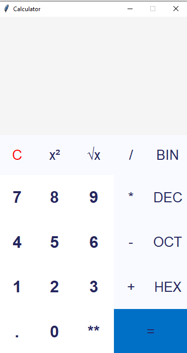

# CALCULATOR APP USING PYTHON 
 

Source Code for Calculator App project of the Python. using tkinter library. I made this project within the mentorship Video Link: https://youtu.be/QZPv1y2znZo" with some additional Features and buttons

 
<b>### Installation and Usage ###</b>
 
download python  from the official website: https://www.python.org/downloads/release/python-385/
<li>download tkinter module  by running this command in cmd or terminal  "pip install tkinter"</li>
<li>download the source code of calculator .py</li>
<li>open the calculator.py file in any text editor (like Vscode ,python IDLE, sublime text, Atom etc.) </li>
<li>run the calculator.py file using a Python interpreter(IDLE) or CMD / Terminal.</li>
 

